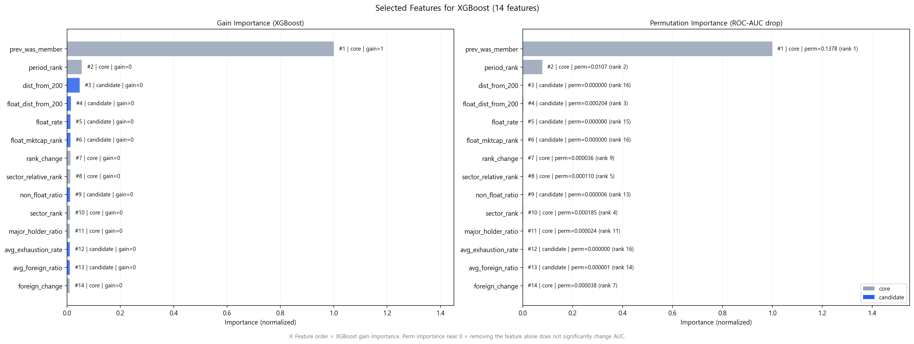
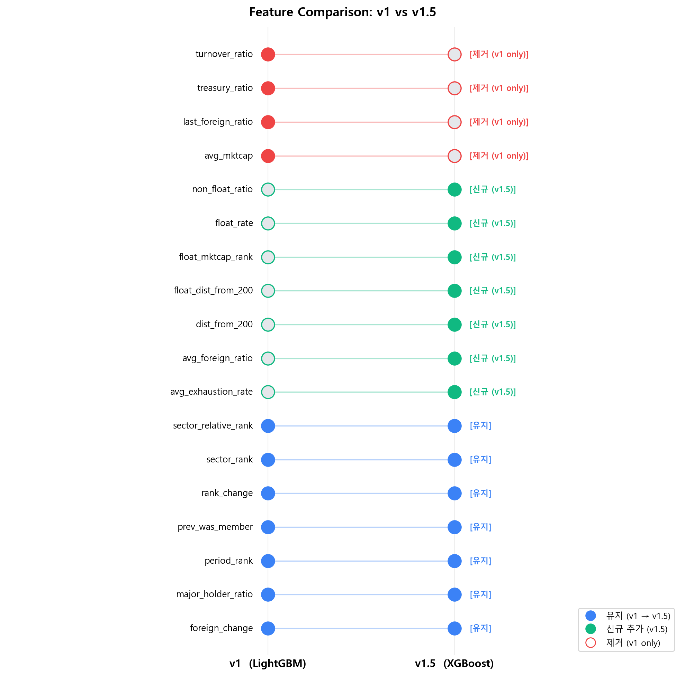

# Next200 v1.5

`Next200 v1.5`는 팀 프로젝트 기반의 `v1`을 그대로 복제한 버전이 아니라, 기존 성능을 유지하면서 더 강한 단일모델을 찾기 위해 모델과 피처 조합을 다시 실험한 개인 확장 버전입니다.

## v1 대비 개선점

`v1`은 `LightGBM + core 10개 피처`를 사용했습니다.  
`v1.5`에서는 아래를 개선했습니다.

- `v1 core feature` 유지
- `dist_from_200`, `float_dist_from_200`, `float_rate`, `float_mktcap_rank`, `non_float_ratio`, `avg_exhaustion_rate`, `avg_foreign_ratio` 등 유동성·경계권 관련 신규 피처 추가
- `LightGBM`에만 고정하지 않고 `XGBoost`, `ExtraTrees`, `RandomForest`, `LogisticRegression`, `CatBoost`까지 비교
- 각 모델의 자체 피처 중요도 기반으로 피처 선택 수행 (모델별 최적 피처 순위 독립 적용)
- holdout 기간을 `2024_H1, 2024_H2, 2025_H1, 2025_H2` 4개 기간으로 확장하여 평가 안정성 강화
- 모델 선정 우선순위를 `strong_in / strong_out precision > top200_accuracy > rank 품질`로 명확히 설정
- 이후 실험 재현을 위해 `SQL snapshot` 기반 관리 방향 정리

## 필터링

v1.5는 전체 종목을 그대로 ranking하지 않고, 지수 방법론에 맞춰 우선주, 리츠, 유동비율 10% 미만, 상장 6개월 미만, 관리/경고 종목, 인프라펀드, 스팩 종목 등을 제외한 뒤 예측합니다.

## 모델 탐색 요약

6개 모델(`LightGBM`, `XGBoost`, `ExtraTrees`, `RandomForest`, `LogisticRegression`, `CatBoost`)에 대해 각 모델의 자체 피처 중요도 기반으로 5, 10, 15, 20, 25개 피처 조합을 coarse search한 결과는 아래와 같습니다.

| 순위 | Model | Feature Count | precision_priority_score | strong_in_precision | strong_out_precision |
|---:|---|---:|---:|---:|---:|
| 1 | ExtraTrees | 15 | 0.6708 | 0.6667 | 0.6750 |
| 2 | CatBoost | 5 | 0.6429 | 0.4940 | 0.7917 |
| 3 | XGBoost | 10 | 0.5908 | 0.4940 | 0.6875 |
| 4 | CatBoost | 10 | 0.5590 | 0.4306 | 0.6875 |
| 5 | CatBoost | 15 | 0.5422 | 0.4385 | 0.6458 |

이후 `ExtraTrees 10~25개 피처`를 세밀하게 탐색한 결과, 최적점은 `14개 피처`로 확인했습니다.

## 최종 선택 모델

현재 기준 최종 선택 모델은 아래와 같습니다.

- Model: `ExtraTrees`
- Feature Count: `14`
- Selected Features:
  - `prev_was_member`
  - `period_rank`
  - `dist_from_200`
  - `float_mktcap_rank`
  - `sector_relative_rank`
  - `float_dist_from_200`
  - `sector_rank`
  - `avg_mktcap`
  - `rank_change`
  - `last_foreign_ratio`
  - `float_rate`
  - `non_float_ratio`
  - `major_holder_ratio`
  - `avg_foreign_ratio`

## v1 vs v1.5 피처 비교

v1에서 사용한 10개 피처와 v1.5에서 최종 선택한 14개 피처의 변화를 아래 차트에서 확인할 수 있습니다.

- **유지**: v1과 v1.5 모두에 포함된 피처
- **신규 (v1.5)**: v1.5에서 새롭게 추가된 피처
- **제거 (v1 only)**: v1에는 있었지만 v1.5에서 제거된 피처

## 14개 피처를 선택한 이유

이 14개는 단순히 중요도가 높아서만이 아니라, `KOSPI200 편입/편출`을 설명하는 핵심 축을 고르게 담고 있다는 점에서 의미가 있습니다.

| Feature | 역할 | 해석 |
|---|---|---|
| `prev_was_member` | 직전 편입 상태 | 이전 반기 KOSPI200 구성종목 여부 |
| `period_rank` | 현재 규모 | 해당 반기 평균 시가총액 순위 |
| `dist_from_200` | 경계권 거리 | 200위 기준 시가총액 순위 거리 |
| `float_mktcap_rank` | 유동 시가총액 순위 | 유동시가총액 기준 전체 순위 |
| `sector_relative_rank` | 섹터 상대 순위 | 섹터 내부 상대적 위치 |
| `float_dist_from_200` | 유동 경계권 거리 | 유동시가총액 기준 200위 거리 |
| `sector_rank` | 섹터 내 위치 | 같은 섹터 안에서의 내부 순위 |
| `avg_mktcap` | 평균 시가총액 | 해당 반기 평균 시가총액 절대값 |
| `rank_change` | 순위 모멘텀 | 직전 반기 대비 시가총액 순위 변화 |
| `last_foreign_ratio` | 직전 외국인 비중 | 직전 반기 말 기준 외국인 보유 비중 |
| `float_rate` | 유동비율 | 전체 시가총액 중 유동 비중 |
| `non_float_ratio` | 비유동 비중 | 주요주주·자사주 등으로 묶인 비유동 비중 |
| `major_holder_ratio` | 지분 구조 | 주요주주 비중 기반의 비유동성 신호 |
| `avg_foreign_ratio` | 평균 외국인 비중 | 해당 반기 평균 외국인 보유 비중 |

## Holdout 결과: v1 vs v1.5

비교 기준은 `2024_H1`, `2024_H2`, `2025_H1`, `2025_H2` 4개 holdout period 평균입니다.

| Metric | v1 (LightGBM) | v1.5_best (ExtraTrees 14) | Delta |
|---|---:|---:|---:|
| `precision_priority_score` | `0.5519` | `0.7068` | `+0.1549` |
| `strong_in_precision` | `0.5206` | `0.7262` | `+0.2056` |
| `strong_in_recall` | `0.3599` | `0.4234` | `+0.0635` |
| `strong_out_precision` | `0.5833` | `0.6875` | `+0.1042` |
| `strong_out_recall` | `0.1274` | `0.2131` | `+0.0857` |
| `top200_accuracy` | `0.9600` | `0.9675` | `+0.0075` |

핵심 해석은 분명합니다.

- `v1.5`는 `strong_in / strong_out precision`에서 `v1`보다 명확히 우세합니다.
- `precision_priority_score` 기준 `+0.155` 개선, `strong_in_precision` 기준 `+0.206` 개선이 확인됩니다.
- `recall`도 함께 개선되어 실제 편입/편출 종목을 더 많이 포착합니다.
- `top200_accuracy`도 함께 좋아졌습니다.

## 전체 기간 비교

전체 기간 비교는 `2020_H1 ~ 2025_H2` 구간에서 `v1`과 `v1.5_best`의 흐름 차이를 보기 위한 보조 시각화입니다.

- `Full Period` 그래프는 `train period + test period`를 모두 포함합니다.
- 따라서 이 그래프는 전체 경향과 분리력 확인용으로 해석해야 합니다.
- 실제 최종 모델 선택의 핵심 근거는 여전히 holdout 결과입니다.
- 여기서 보이는 `strong_in_precision`, `strong_out_precision`은 **예측한 strong 후보 중 실제로 맞은 비율**을 뜻합니다.
- 즉, 이 그래프는 **전체 편입/편출 종목을 모두 맞췄는지**를 직접 보여주는 그래프가 아닙니다.
- 전체 편입/편출 사건 대비 놓친 종목까지 함께 보려면 아래 Performance 시각화 섹션의 `recall`, `missed_actual`, `confusion matrix`를 같이 봐야 합니다.

## Performance 시각화

`v1.5_best = ExtraTrees + 14개 피처` 기준으로 강한 편입/편출 신호가 실제 1개월 성과에서 어떤 결과를 냈는지도 함께 확인했습니다.

- 기간별 `strong_in / strong_out / benchmark return`
  - H1 기준: `5/1 이후 첫 관측일 -> 6월 2째주 금요일 이전 마지막 관측일`
  - H2 기준: `11/1 이후 첫 관측일 -> 12월 2째주 금요일 이전 마지막 관측일`

- 기간별 `strong_in / strong_out precision & recall`
- 기간별 예측 수 / 실제 수 / 적중 수
- 기간별 `recall / missed_actual / false_positive`
- 반기별 2x2 confusion matrix

| 기간 | benchmark | strong_in | in 초과(in-bm) | strong_out | out 초과(out-bm) |
|---|---:|---:|---:|---:|---:|
| 2020_H1 | +8.3% | +8.7% | +0.4%p | +6.1% | -2.2%p |
| 2020_H2 | +12.3% | +26.4% | +14.0%p | +4.6% | -7.7%p |
| 2021_H1 | +4.0% | +31.2% | +27.2%p | +7.7% | +3.8%p |
| 2021_H2 | -2.4% | -3.4% | -1.0%p | +10.4% | +12.8%p |
| 2022_H1 | -1.3% | -9.7% | -8.4%p | -5.2% | -3.9%p |
| 2022_H2 | +5.7% | -8.3% | -14.0%p | +11.6% | +5.9%p |
| 2023_H1 | +7.3% | +3.1% | -4.2%p | -7.4% | -14.7%p |
| 2023_H2 | +7.4% | +5.6% | -1.8%p | +3.8% | -3.6%p |
| **2024_H1** | **+2.5%** | **+27.4%** | **+24.9%p** | **-3.2%** | **-5.7%p** |
| **2024_H2** | **-3.3%** | **+11.7%** | **+15.0%p** | **-15.2%** | **-11.9%p** |
| **2025_H1** | **+14.6%** | **+5.8%** | **-8.8%p** | **+8.2%** | **-6.4%p** |
| **2025_H2** | **+7.1%** | **+8.3%** | **+1.3%p** | **+4.3%** | **-2.7%p** |

※ 굵게 표시된 기간은 holdout(test) period. train period는 참고용.
※ out 초과가 음수 = 편출 예측 종목이 benchmark보다 낮은 수익률 → 예측 적중.

이 섹션은 단순히 `precision`만 높아 보이는 상황을 피하기 위해 추가했습니다.  
즉, 예측한 종목 중 맞춘 비율뿐 아니라 실제 발생 종목을 얼마나 놓쳤는지까지 함께 보도록 구성했습니다.

### Confusion Matrix 설명

각 반기 confusion matrix는 해당 반기의 전체 eligible universe를 기준으로 계산합니다.

- `TP`: 편입/편출할 것이라고 예측했고, 실제로 편입/편출한 종목
- `FN`: 편입/편출하지 않을 것이라고 예측했지만, 실제로는 편입/편출한 종목
- `FP`: 편입/편출할 것이라고 예측했지만, 실제로는 편입/편출하지 않은 종목
- `TN`: 편입/편출하지 않을 것이라고 예측했고, 실제로도 편입/편출하지 않은 종목

해석할 때 주의할 점은 아래와 같습니다.

- `TN`은 전체 유니버스 기준으로 계산되기 때문에 보통 가장 크게 나옵니다.
- 따라서 이 프로젝트에서는 `TP`, `FP`, `FN`과 함께 `precision`, `recall`, `missed_actual`를 더 중요하게 해석합니다.
- 예를 들어 `precision = 100%`라도 `FN`이 존재하면 실제 편입/편출 종목을 일부 놓친 상황일 수 있습니다.

## 한계 & 개선점

`v1.5`는 편입/편출 signal precision과 `Top200` 분류 성능은 분명히 개선했지만, `KOSPI200` 내부 종목의 `1위 ~ 200위` 순서를 더 정교하게 맞추는 rank quality는 아직 개선 여지가 있습니다.

즉 현재는 v1모델 대비

- 누가 편입/편출 후보인가
- 누가 Top200 안에 드는가

를 더 잘 맞추는 방향에서 성과를 냈고, 앞으로는

- Top200 내부에서의 순위 정확도
- 200위권 boundary 종목 예측 정확도

까지 더 정교하게 맞추는 방향으로 v2모델로 확장할 계획입니다.

다음 단계로는 아래를 검토하고 있습니다.

- 더 정확한 시점 반영을 위한 daily data 활용
- 내부 순위 예측을 직접 반영하는 추가 피처 설계
- 경계권 종목 분리 강화를 위한 feature engineering
- 필요 시 더 고성능의 tabular model 확장 검토
- streamlit 실행 시 로딩 시간 축소

## 실행 안내

이 프로젝트를 직접 실행하려면 아래 파일을 참고하세요.

- 실행 가이드: `howtouse.txt`
- 환경변수 예시: `.env.example`

`howtouse.txt`에는 PowerShell 기준 실행 순서가 정리되어 있고,
`.env.example`에는 필요한 환경변수 항목이 정리되어 있습니다.
