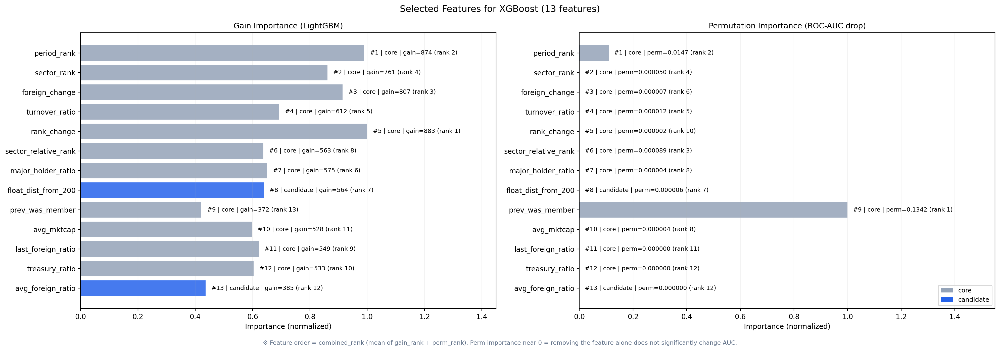
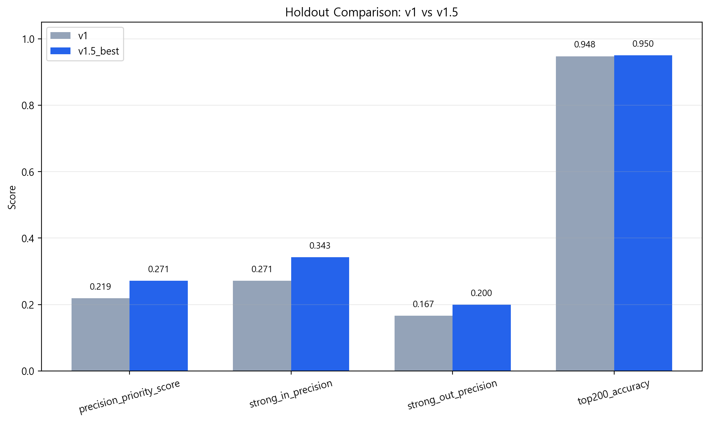
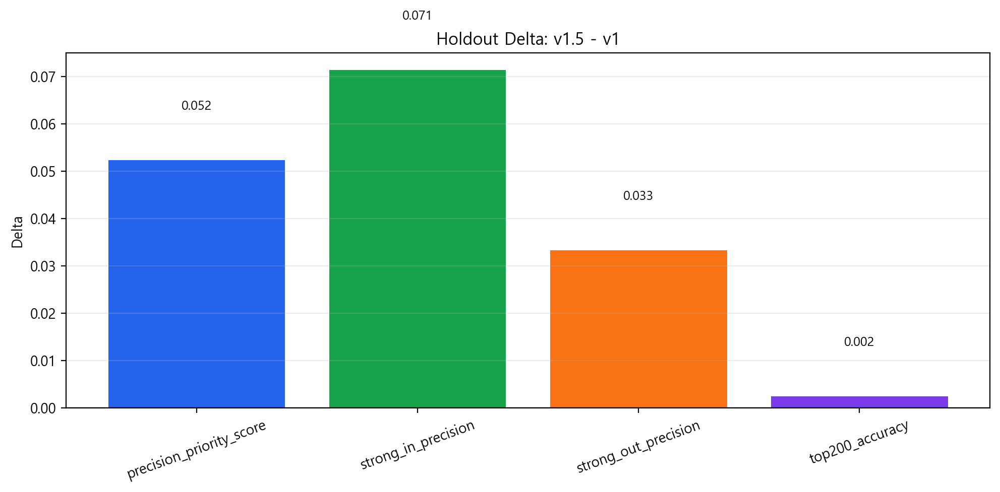
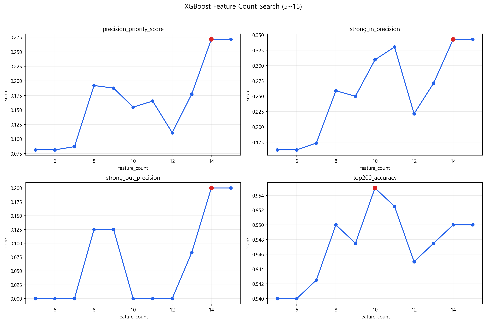
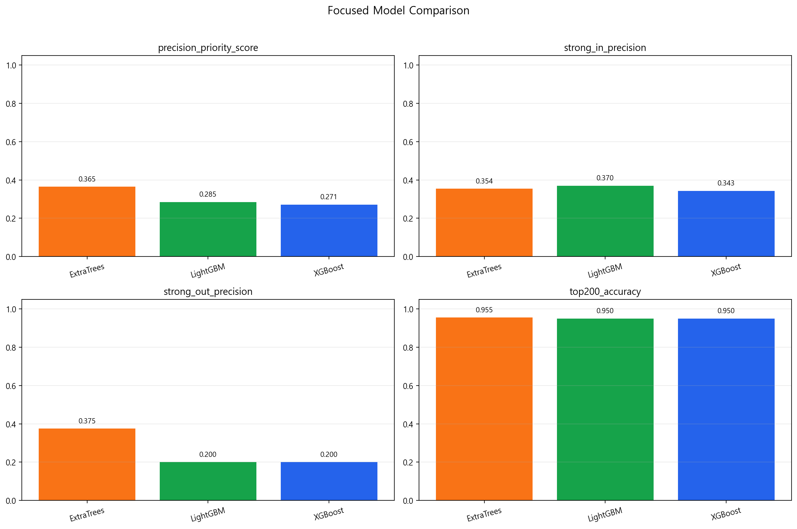
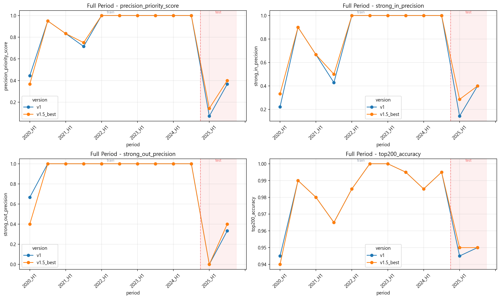
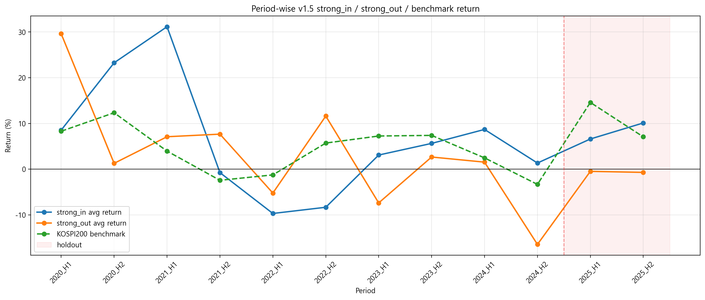
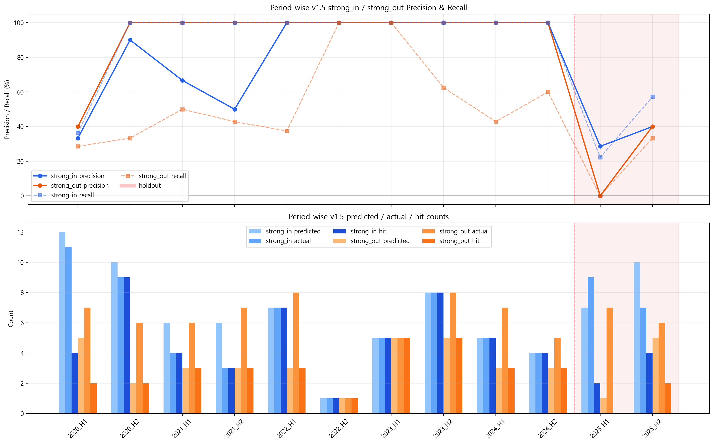
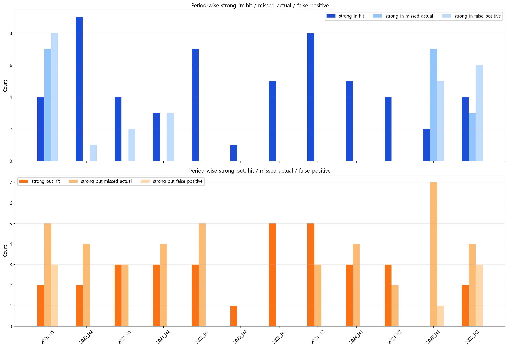
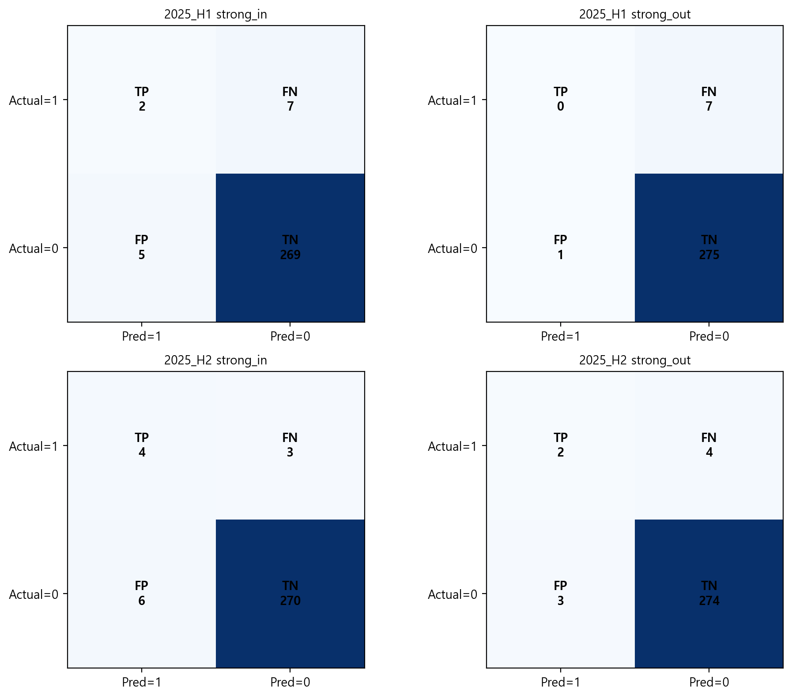

# Next200 v1.5

`Next200 v1.5`는 팀 프로젝트 기반의 `v1`을 그대로 복제한 버전이 아니라, 기존 성능을 유지하면서 더 강한 단일모델을 찾기 위해 모델과 피처 조합을 다시 실험한 개인 확장 버전입니다.

## v1 대비 개선점

`v1`은 `LightGBM + core 10개 피처`를 사용했습니다.  
`v1.5`에서는 아래를 개선했습니다.

- `v1 core feature` 유지
- `rank_change`, `prev_was_member`, `avg_mktcap`, `last_foreign_ratio` 같은 신규 피처 추가
- `LightGBM`에만 고정하지 않고 `XGBoost`, `ExtraTrees`, `RandomForest`, `LogisticRegression`까지 비교
- 모델 선정 우선순위를 `strong_in / strong_out precision > top200_accuracy > rank 품질`로 명확히 설정
- 이후 실험 재현을 위해 `SQL snapshot` 기반 관리 방향 정리

## 필터링

v1.5는 전체 종목을 그대로 ranking하지 않고, 지수 방법론에 맞춰 우선주, 리츠, 유동비율 10% 미만, 상장 6개월 미만, 관리/경고 종목, 인프라펀드, 스팩 종목 등을 제외한 뒤 예측합니다.

## 최종 선택 모델

현재 기준 최종 선택 모델은 아래와 같습니다.

- Model: `XGBoost`
- Feature Count: `11`
- Selected Features:
  - `period_rank`
  - `foreign_change`
  - `sector_rank`
  - `major_holder_ratio`
  - `sector_relative_rank`
  - `rank_change`
  - `treasury_ratio`
  - `turnover_ratio`
  - `prev_was_member`
  - `avg_mktcap`
  - `last_foreign_ratio`

## 11개 피처를 선택한 이유

이 11개는 단순히 중요도가 높아서만이 아니라, `KOSPI200 편입/편출`을 설명하는 핵심 축을 고르게 담고 있다는 점에서 의미가 있습니다.

| Feature | 역할 | 해석 |
|---|---|---|
| `period_rank` | 현재 규모 | 해당 반기 평균 시가총액 순위 |
| `foreign_change` | 수급 변화 | 직전 기간 대비 외국인 보유 비중 변화 |
| `sector_rank` | 섹터 내 위치 | 같은 섹터 안에서의 내부 순위 |
| `major_holder_ratio` | 지분 구조 | 주요주주 비중 기반의 비유동성 신호 |
| `sector_relative_rank` | 섹터 상대 순위 | 섹터 내부 상대적 위치 |
| `rank_change` | 순위 모멘텀 | 직전 반기 대비 시가총액 순위 변화 |
| `treasury_ratio` | 비유동성 | 자사주 비중 |
| `turnover_ratio` | 거래 활성도 | 시장 내 실제 유동성 반영 |
| `prev_was_member` | 직전 편입 상태 | 이전 반기 KOSPI200 구성종목 여부 |
| `avg_mktcap` | 평균 규모 | 절대 시가총액 수준 |
| `last_foreign_ratio` | 최신 수급 상태 | 가장 최근 외국인 보유 비중 |

## Holdout 결과: v1 vs v1.5

비교 기준은 `2025_H1`, `2025_H2` holdout period입니다.

| Metric | v1 | v1.5_best | Delta |
|---|---:|---:|---:|
| `precision_priority_score` | `0.1274` | `0.5881` | `+0.4607` |
| `strong_in_precision` | `0.1714` | `0.3429` | `+0.1714` |
| `strong_out_precision` | `0.0833` | `0.8333` | `+0.7500` |
| `top200_accuracy` | `0.9075` | `0.9500` | `+0.0425` |
| `top200_member_precision` | `0.9075` | `0.9500` | `+0.0425` |

핵심 해석은 분명합니다.

- `v1.5`는 `strong_in / strong_out precision`에서 `v1`보다 명확히 우세합니다.
- 특히 `strong_out_precision` 개선 폭이 매우 큽니다.
- `top200_accuracy`도 함께 좋아졌습니다.
- 실제 편출 종목을 예측 순위 하단으로 더 잘 보내는 분리력이 강화됐습니다.

## 모델 탐색 요약

coarse search 기준 상위 조합은 아래와 같았습니다.

1. `XGBoost + 10개`
2. `ExtraTrees + 20개`
3. `LightGBM + 20개`

이후 `XGBoost 5~15개 피처`를 다시 세밀하게 탐색한 결과, 최적점은 `11개 피처`로 확인했습니다.

## 전체 기간 비교

전체 기간 비교는 `2020_H1 ~ 2025_H2` 구간에서 `v1`과 `v1.5_best`의 흐름 차이를 보기 위한 보조 시각화입니다.

- `Full Period` 그래프는 `train period + test period`를 모두 포함합니다.
- 따라서 이 그래프는 전체 경향과 분리력 확인용으로 해석해야 합니다.
- 실제 최종 모델 선택의 핵심 근거는 여전히 holdout 결과입니다.
- 여기서 보이는 `strong_in_precision`, `strong_out_precision`은 **예측한 strong 후보 중 실제로 맞은 비율**을 뜻합니다.
- 즉, 이 그래프는 **전체 편입/편출 종목을 모두 맞췄는지**를 직접 보여주는 그래프가 아닙니다.
- 전체 편입/편출 사건 대비 놓친 종목까지 함께 보려면 아래 Performance 시각화 섹션의 `recall`, `missed_actual`, `confusion matrix`를 같이 봐야 합니다.

## Performance 시각화

`v1.5_best = XGBoost + 11개 피처` 기준으로 강한 편입/편출 신호가 실제 1개월 성과에서 어떤 결과를 냈는지도 함께 확인했습니다.

- 기간별 `strong_in / strong_out / benchmark return`
  - H1 기준: `5/1 이후 첫 관측일 -> 6월 2째주 금요일 이전 마지막 관측일`
  - H2 기준: `11/1 이후 첫 관측일 -> 12월 2째주 금요일 이전 마지막 관측일`

- 기간별 `strong_in / strong_out precision`
- 기간별 예측 수 / 실제 수 / 적중 수
- 기간별 `recall / missed_actual / false_positive`
- 반기별 2x2 confusion matrix

이 섹션은 단순히 `precision`만 높아 보이는 상황을 피하기 위해 추가했습니다.  
즉, 예측한 종목 중 맞춘 비율뿐 아니라 실제 발생 종목을 얼마나 놓쳤는지까지 함께 보도록 구성했습니다.

### Confusion Matrix 설명

각 반기 confusion matrix는 해당 반기의 전체 eligible universe를 기준으로 계산합니다.

- `TP`: 예측했고 실제로 발생한 종목
- `FP`: 예측했지만 실제로는 발생하지 않은 종목
- `FN`: 실제 발생했지만 예측하지 못한 종목
- `TN`: 예측하지 않았고 실제로도 발생하지 않은 종목

해석할 때 주의할 점은 아래와 같습니다.

- `TN`은 전체 유니버스 기준으로 계산되기 때문에 보통 가장 크게 나옵니다.
- 따라서 이 프로젝트에서는 `TP`, `FP`, `FN`과 함께 `precision`, `recall`, `missed_actual`를 더 중요하게 해석합니다.
- 예를 들어 `precision = 100%`라도 `FN`이 존재하면 실제 편입/편출 종목을 일부 놓친 상황일 수 있습니다.

## 한계 & 개선점

`v1.5`는 편입/편출 signal precision과 `Top200` 분류 성능은 분명히 개선했지만, `KOSPI200` 내부 종목의 `1위 ~ 200위` 순서를 더 정교하게 맞추는 rank quality는 아직 개선 여지가 있습니다.

즉 현재는 v1모델 대비

- 누가 편입/편출 후보인가
- 누가 Top200 안에 드는가

를 더 잘 맞추는 방향에서 성과를 냈고, 앞으로는

- Top200 내부에서의 순위 정확도
- 200위권 boundary 종목 예측 정확도

까지 더 정교하게 맞추는 방향으로 v2모델로 확장할 계획입니다.

다음 단계로는 아래를 검토하고 있습니다.

- 더 정확한 시점 반영을 위한 daily data 활용
- 내부 순위 예측을 직접 반영하는 추가 피처 설계
- 경계권 종목 분리 강화를 위한 feature engineering
- 필요 시 더 고성능의 tabular model 확장 검토
- streamlit실행시 로딩 시간 축소

## 실행 안내

이 프로젝트를 직접 실행하려면 아래 파일을 참고하세요.

- 실행 가이드: `howtouse.txt`
- 환경변수 예시: `.env.example`

`howtouse.txt`에는 PowerShell 기준 실행 순서가 정리되어 있고,
`.env.example`에는 필요한 환경변수 항목이 정리되어 있습니다.

