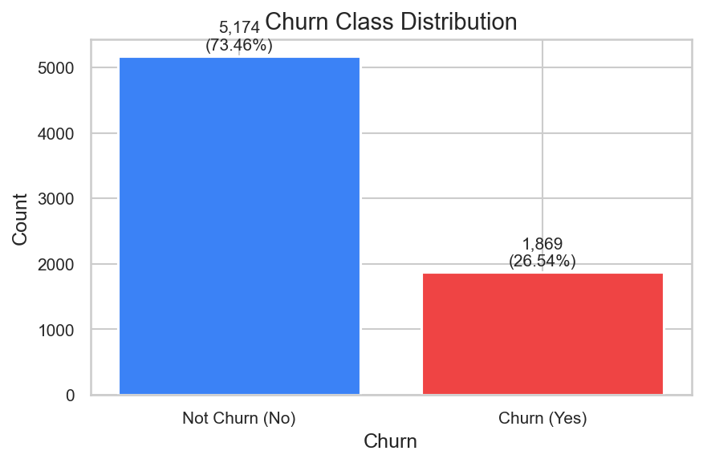
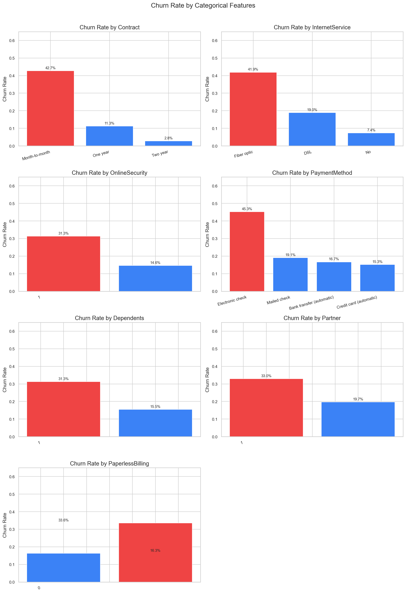
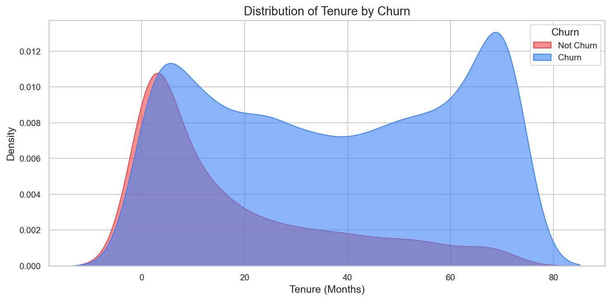
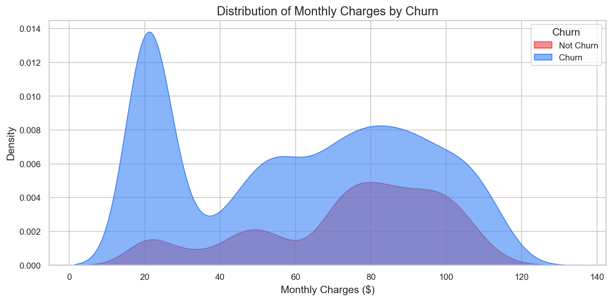
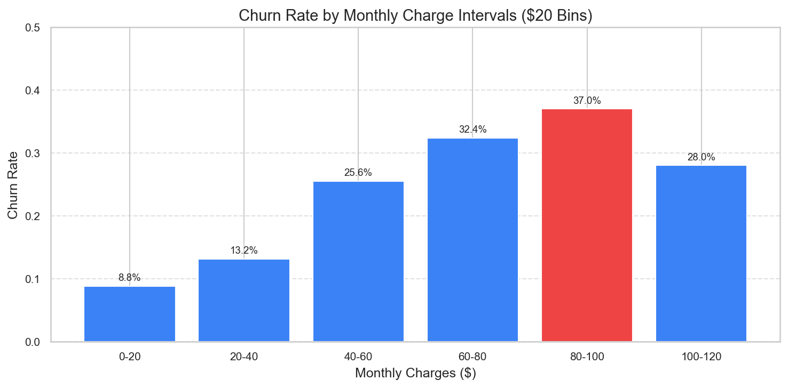
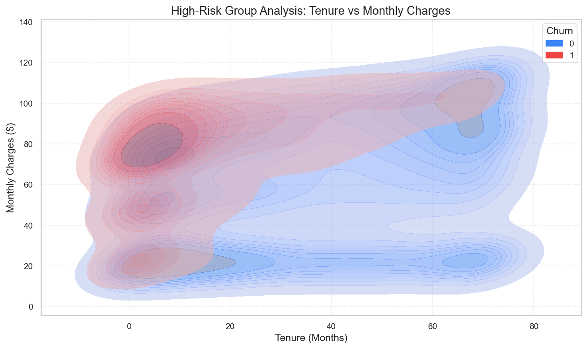

# 통신사 고객 이탈 데이터 분석


Kaggle의 Telco Customer Churn 데이터를 활용해 고객 이탈 패턴을 탐색하고, 전처리 및 시각화를 통해 핵심 인사이트를 도출한 분석 프로젝트입니다.

> 신규 고객 유치 비용은 기존 고객 유지 비용보다 **5~25배** 더 높습니다.
> 이 분석은 이탈 징후를 데이터로 포착해 선제적 대응 전략을 수립하는 것을 목표로 합니다.

---

## 데이터셋

- **출처**: [Kaggle — Telco Customer Churn](https://www.kaggle.com/datasets/blastchar/telco-customer-churn)
- **규모**: 7,043명 고객, 21개 변수

| 변수 유형 | 주요 컬럼 |
|-----------|-----------|
| 인구통계 | gender, SeniorCitizen, Partner, Dependents |
| 서비스 이용 | InternetService, OnlineSecurity, StreamingTV 등 |
| 계약 정보 | Contract, PaymentMethod, MonthlyCharges, TotalCharges |
| 타깃 | **Churn** (이탈 여부) |

> 데이터 파일은 위 Kaggle 링크에서 다운로드 후 `./data/` 폴더에 저장하세요.

---

## 분석 흐름

```
데이터 로드 → EDA → 데이터 전처리 → 시각화 → 인사이트 도출
```

---

## 주요 발견

### Churn 분포



전체 7,043명 중 **1,869명(26.5%)이 이탈**했습니다. 약 3:1 비율의 클래스 불균형이 존재합니다.

---

### 범주형 변수별 이탈률



- **계약 유형**: Month-to-month 이탈률 **42.7%** — 2년 계약(2.8%) 대비 약 15배
- **인터넷 서비스**: Fiber optic 이용 고객의 이탈률이 상대적으로 높음
- **결제 방법**: Electronic check(수동 결제) 고객의 이탈률이 가장 높음
- **부양가족·파트너**: 없을수록 이탈률 높음

---

### 가입 기간별 이탈 분포



이탈은 **가입 초기 0~10개월에 집중**되며, 20개월 이후부터 안정화됩니다.

---

### 월 요금별 이탈 분포



이탈 고객은 유지 고객에 비해 **고요금대에 분포**하는 경향이 뚜렷합니다.

- 이탈 고객 평균 월 요금: **$74.4**
- 유지 고객 평균 월 요금: **$61.3**

---

### 월 요금 구간별 이탈률



**$80~$100 구간**에서 이탈률이 가장 높게 나타납니다.

---

### 고위험군 분석 — 가입 기간 × 월 요금



**단기 가입(0~10개월) + 고요금($70 이상)** 조합의 고객군에서 이탈이 가장 집중됩니다.

---

## 데이터 전처리 요약

| 처리 항목 | 내용 | 판단 근거 |
|-----------|------|-----------|
| `customerID` 제거 | 식별자 컬럼 | 분석에 불필요 |
| `DeviceProtection` 제거 | 결측 3,463개 | 결측 여부와 무관하게 이탈 비율 동일 |
| `MultipleLines`, `PhoneService`, `gender` 제거 | 이탈률 차이 미미 | 최대 편차 3.7%, 1.8%, 0.8% |
| `TotalCharges` 타입 변환 | 문자열 → 수치형 | 공백값 11개는 신규 가입 고객(tenure=0) → 0 대체 |
| `MonthlyCharges` 결측 대체 | 1개 (2961번 행) | 동일 서비스 조합 표본의 TotalCharges/tenure 값으로 검증 후 54.05 대체 |
| `Contract`, `PaymentMethod` 결측 대체 | 각 1개 | 최빈값 대체 |
| 이진 인코딩 | Yes/No → 1/0 | `Partner`, `Dependents`, `PaperlessBilling`, `Churn` |
| 부가 서비스 인코딩 | Yes → 1, 그 외 → 0 | `No internet service`도 0으로 통일 |

---

## 결론

| 분석 항목 | 주요 인사이트 |
|-----------|---------------|
| **이탈률** | 전체 26.5% 이탈 (1,869명 / 7,043명) |
| **계약 유형** | Month-to-month 이탈률 42.7% — 2년 계약(2.8%) 대비 약 15배 |
| **가입 기간** | 이탈은 0~10개월 초기에 집중, 20개월 이후 안정화 |
| **월 요금** | $80~$100 구간 이탈률 최고치 |
| **요금 차이** | 이탈 고객 평균 $74.4 vs 유지 고객 평균 $61.3 |
| **결제 방법** | Electronic check(수동 결제) 이탈률 가장 높음 |

### 전략적 시사점

- **단기 계약 고객 집중 관리**: Month-to-month 계약 고객에게 장기 계약 전환 인센티브 제공
- **초기 이탈 방어**: 가입 후 10개월 이내 고객 대상 선제적 혜택 및 관리 강화
- **고요금 구간 리텐션**: $80 이상 고요금 고객에게 맞춤형 유지 전략 적용
- **자동 결제 전환 유도**: Electronic check 고객의 자동 결제 전환 프로모션으로 이탈 리스크 감소
